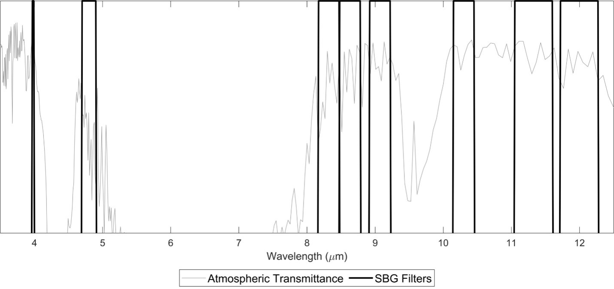
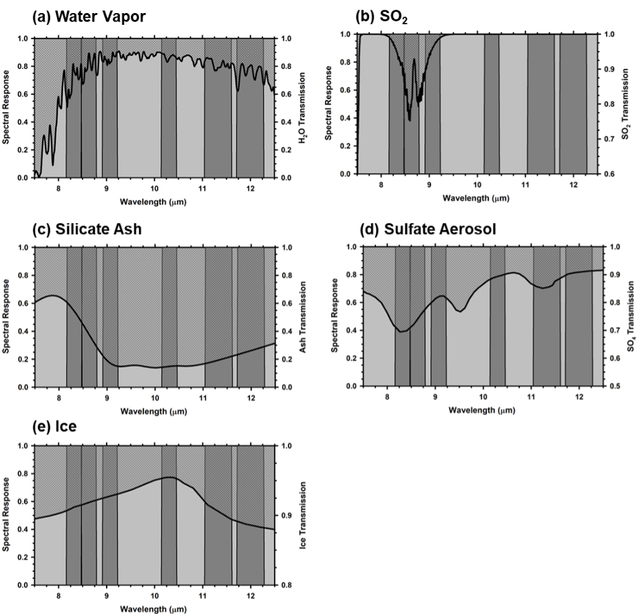

# Surface Biology and Geology (SBG) Observing Terrestrial Thermal Emission Radiometer (OTTER)

## SBG-TIR OTTER Level 4 Volcanic Activity (L4-VA) Data Product Algorithm

Vince Realmuto (he/him) 
[vincent.j.realmuto@jpl.nasa.gov](mailto:vincent.j.realmuto@jpl.nasa.gov) 
NASA Jet Propulsion Laboratory 329A

[Michael S. Ramsey](https://github.com/michaelsramsey) 
[mramsey@pitt.edu](mailto:mramsey@pitt.edu) 
University of Pittsburgh

[James O. Thompson](https://github.com/jthompson2710) 
[james.thompson@beg.utexas.edu](mailto:james.thompson@beg.utexas.edu) 
University of Texas Austin

# Abstract
The 2017-2027 Decadal Survey for Earth Science and Applications from Space (ESAS 2017) was released in January 2018. ESAS 2017 was driven by input from the scientific community and policy experts and provides a strategic vision for the next decade of Earth observation that informs federal agencies responsible for the planning and execution of civilian space-based Earth-system programs in the coming decade. These include the National Aeronautics and Space Administration (NASA), the National Oceanic and Atmospheric Administration (NOAA), and the U.S. Geological Survey (USGS). NASA has, thus far, utilized this document as a guide to inform exploration of new Earth mission concepts that are later considered as can-didates for fully funded missions. High-priority emphasis areas and targeted observables include global-scale Earth science questions related to hydrology, ecosystems, weather, climate, and solid earth. One of the Designated Observables (DO’s) identified by ESAS 2017 was Surface Biology and Geology (SBG) with a goal to acquire concurrent global hyperspectral visible to shortwave infrared (VSWIR; 380–2500 nm) and multispectral midwave and thermal infrared (MWIR: 3–5 μm; TIR: 8–12 μm) image data at high spatial resolution (~30 m in the VSWIR and ~ 60 m in the TIR) at sub-monthly temporal resolution globally. The final sensor characteristics will be determined during the mission formulation phase, but ESAS 2017 provides guidance for a VSWIR instrument with 30–45 m pixel resolution, ≤16 day global revisit, SNR > 400 in the VNIR, SNR > 250 in the SWIR, and 10 nm sampling in the range 380–2500 nm. It also recommends a TIR instrument with more than five channels in 8–12 μm, and at least one channel at 4 μm, ≤60 m pixel resolution, ≤3 day global revisit, and noise equivalent delta temperature (NEdT) ≤0.2 K (NASEM, 2018; Schimel et al., 2020). Alone, SBG will provide a comprehensive global monitoring for multiple scientific disciplines. Complemented with systems like Landsat and Sentinel-2 VSWIR, global change processes with faster than 16-day global change rates can be mapped. Further, complimented with planned TIR systems such as LSTM and TRISHNA, the temporal revisit could be as frequent as 1-day at the equator, making the system excellent for tracking dynamic thermal features and hazards. This document will grow to fully describe the planned Level-4 Volcanic Activity (VA) product for the SBG TIR data.

_______________________________________________________________________________________________________________________
<i>This repository will gradually expand to contain the Surface Biology and Geology Thermal Infrared (SBG-TIR) OTTER level 4 volcanic activity (L4-VA) data product algorithm.</i>
_______________________________________________________________________________________________________________________

<!-- The SBG evapotranspiration product combines the [surface temperature and emissivity observations from the OTTER sensor](https://github.com/sbg-tir/SBG-TIR-L2-LSTE) with the [NDVI and albedo estimated by STARS](https://github.com/sbg-tir/SBG-TIR-L2-STARS), estimates near-surface meteorology by downscaling GEOS-5 FP to these three high resolution images, and runs these variables through a set of surface energy balance models. -->

<!-- The repositories for the evapotranspiration algorithms are located in the [JPL-Evapotranspiration-Algorithms](https://github.com/JPL-Evapotranspiration-Algorithms) organization. -->

## 1. Introduction to Data Products

The Surface Biology and Geology (SBG) thermal infrared (TIR) instrument – termed the Observing Terrestrial Thermal Emission Radiometer (OTTER) consists of a TIR multispectral scanner with six spectral bands operating between 8.0 and 13.0 µm and two mid-infrared (MIR) bands between 3.0 and 5.0 µm, with a 60 m pixel resolution, an equatorial three day revisit, and a noise equivalent delta temperature (NEdT) ≤0.2 K (NASEM, 2018; Schimel et al., 2020). The TIR data will be acquired with a wide swath width of 935 km (60) from an altitude of ~700 km. OT-TER instrument design and data derive their heritage from the ECOSTRESS instrument, which is a five-channel multispectral TIR scanner that was launched to the International Space Station (ISS) in June 2018. ECOSTRESS has a 70-m spatial resolution with a wide swath width and revisit time that is variable between 3-5 days on average (Table 1).

| **Instrument** | **Platform** | **Resolution (m)** | **Revisit (days)** | **Daytime overpass** | **TIR bands (8-12.5 µm)** | **Launch** |
| --- | --- | --- | --- | --- | --- | --- |
| OTTER | SBG | 60 | 3 | 12:30 | 6 | 2028 |
| ECOSTRESS | ISS | 38 × 68 | 3-5 | Variable | 5 | 2018 |
| LSTM |  | 50 | 16 | 10:30 | 5 | 2028 |
| TRISHNA |  | 57 | 16 | 10:30 | 4 | 2025 |
| ASTER | Terra | 90 | 16 | 10:30 | 16 | 1999 |
| ETM+/TIRS | Landsat 7/8 | 60-100 | 16 | 10:11 | 1/2 | 1999/2013 |
| VIIRS | Suomi-NPP | 750 | Daily | 1:30 / 13:30 | 4 | 2011 |
| MODIS | Terra/Aqua | 1000 | Daily | 10:30 / 13:30 | 3 | 1999/2002 |
| GOES | Multiple | 4000 | Daily | Every 15 min 2 | 2000 |
*Table 1. SBG measurement characteristics compared to other operational and planned (*) spaceborne TIR instru-ments 1*

This document outlines the theory and methodology for generating the OTTER Level-4 (L4) Volcanic Activity (VA) product. The VA product is only applied to a 50 km subset of the OTTER data centered on each of the world’s active and potentially active volcanoes (REFS). As such, it represents a small data volume. The VA uses the L2 land surface and emissivity (LSTE) product derived from the six TIR spectral bands to characterize the composition of volcanic plumes. The LSTE products are retrieved from the surface spectral radiance, which is obtained by atmospherically correcting the at-sensor spectral radiance. The VA also uses the L2 radiance at sensor product for the MIR and TIR to derive volcanic thermal flux.

The remainder of the document will discuss the SBG instrument characteristics, provide a background on TIR remote sensing, give a full description and background on the volcanic temper-ature and compositional modeling required for the VA product, provides quality assessment, dis-cuss numerical simulation studies and, finally, outline a validation plan.

## 2. SBG Intstrument Charactersitics 
### 2.1.	Band posiIt is expected that small adjustments to the band positions, widths, and transmission will be made based on ongoing engineering filter perfor-mance capabilities and finalized once the filters are fabricated.

*Figure 1. SBG boxcar filters for two MIR bands and six TIR bands from 3.8-12.5 microns with a typical atmospheric transmittance spectrum in gray highlighting the atmospheric window regions. Note the spectral width and location of the filters are finalized, however the spectral shape will be determined when the detectors are fabricated*

| **Band #** | **Center Wavelength (µm)** | **Spectral Width (FWHM) (nm)** | **Tolerance Center Wavelength (± nm)** | **Tolerance Spectral Width (±nm)** | **Knowledge Center Wavelength (±nm)** | **Knowledge Spectral Width (±nm)** | **Accuracy (K)** | **NEΔT (K)** | **Range (K)** |
| --- | --- | --- | --- | --- | --- | --- | --- |--- | --- |
| MIR-1 | 3.98 | 20 | 50 | 10 | 10 | 10 | ≤3@750 | ≤0.3@750 | 700-1200 |
| MIR-2 | 4.8 | 150 | 100 | 50 | 20 | 20 | ≤1@450 | ≤0.2@450 | 400-800 |
| TIR-1 | 8.32 | 300 | 100 | 50 | 20 | 20 | ≤0.5@275 | ≤0.2@275 | 200-500 |
| TIR-2 | 8.63 | 300 | 100 | 50 | 20 | 20 | ≤0.5@275 | ≤0.2@275 | 200-500 |
| TIR-3 | 9.07 | 300 | 100 | 50 | 20 | 20 | ≤0.5@275 | ≤0.2@275 | 200-500 |
| TIR-4 | 10.30 | 300 | 50 | 50 | 20 | 20 | ≤0.5@275 | ≤0.2@275 | 200-500 |
| TIR-5 | 11.35 | 300 | 100 | 50 | 20 | 20 | ≤0.5@275 | ≤0.2@275 | 200-500 |
| TIR-6 | 12.05 | 300 | 100 | 50 | 20 | 20 | ≤0.5@275 | ≤0.2@275 | 200-500 |
*Table 2: SBG final band positions and characteristics.*

### 2.2. Radiometer
The TIR instrument will operate as a push-whisk mapper very similar to ECOSTRESS with 256 pixels in the cross-whisk direction for each spectral channel. As the spacecraft moves forward, the scan mirror sweeps the focal plane image 68.8 across nadir in the cross-track direction, which enables a wide swath (935 km) from the spacecraft altitude of ~700 km. Each sweep is 256-pixels wide with the different spectral bands are swept across a given point on the ground sequentially. The scan mirror rotates at a constant angular speed and images two on-board blackbody targets at 300 K and 340 K with each cross-track sweep every 1.29 seconds to provide gain and offset cali-brations.

| **Spectral** |
| --- | --- |
| Bands (µm) | 4, 4.8, 8.32, 8.63, 9.07, 10.3, 11.35, 12.05 |
| Bandwidth (nm) | 20, 150, 300, 300, 300, 300, 500, 500 |
| Accuracy at 300 K | <0.01 µm |
| **Radiometric** |
| --- | --- |
| Range | TIR bands (200 - 500 K)  4 micron band (700 -1200 K)  4.8 micron band (400 - 800 K |
| Resolution | < 0.05 K, linear quantization to 14 bits |
| Accuracy | \< 0.5 K 3-sigma at 275 K |
| Precision (NEdT) | < 0.2 K |
| Linearity | >99% characterized to 0.1 % |
| **Spatial** |
| --- | --- |
| IFOV | 60m |
| MTF | >0.65 at FNy |
| Scan Type | Push-Whisk |
| Swath Width at 665-km altitude | 935 km (+/- 34.4°) |
| Cross Track Samples | 10,000 *(check)* |
| Swath Length | 10,000 *(check)* |
| Down Track Samples | 256 |
| Band to Band Co-Registration | 0.2 pixels (12 m) |
| Pointing Knowledge | 10 arcsec (0.5 pixels) (approximate value, currently under evaluation) |
| **Temporal** |
| --- | --- |
| Orbit Crossing | Multiple |
| Global Land Repeat | Multiple |
| **On Orbit Calibration**   
| --- | --- |
| Lunar views | 1 per month {radiometric} |
| Blackbody views | 1 per scan {radiometric} |
| Deep Space views | 1 per scan {radiometric} |
| Surface Cal Experiments | 2 (day/night) every 5 days {radiometric} |
| Spectral Surface Cal Experiments | 1 per year |
| **Data Collection** |
| --- | --- |
| Time Coverage | Day and Night |
| Land Coverage | Land surface above sea level |
| Water Coverage | n/a |
| Open Ocean | n/a |
| Compression | 2:1 lossless |
*Table 3. SBG TIR instrument and measurement characteristics.*

##	3. Volcanic Plume Theory and Methodology
### 3.1. Thermal Infrared Remote Sensing of Volcanic Plumes
Volcanic sulfur dioxide (SO2) emissions provide insights into magmatic and hydrothermal processes internal to volcanoes (e.g., Oppenheimer et al., 2011), and the sulfate (SO4) aerosols re-sulting from volcanic emissions affect the Earth system on local (e.g., Longo, 2013), regional (e.g., Yuan et al., 2011), and global (e.g., Ivy et al., 2017) scales. Long-term (years to decades) archives of satellite-based observations of volcanic SO2 plumes and clouds have advanced our understand-ing of transport, dispersion, and chemical evolution of these emissions (Carn et al., 2016). Howev-er, the satellite data records are based on UV, TIR, and microwave observations at coarse (tens to hundreds of km) spatial resolutions. In a recent review of the OMI data record of SO2 emissions, Carn et al. (2017) point to the need for satellite observations at finer spatial resolutions to resolve the sources of volcanic plumes. In addition, the ability to map the SO2 content of emissions at their sources is a critical step in the accurate estimation of emission rates. OTTER will provide global measurements of multispectral TIR radiance at the requisite spatial resolution of 60 m, with a repeat cycle of three days at the equator (Tables 1, 2).

We detect and map volcanic plumes based on the absorption of TIR radiance passing through the plumes enroute to the sensor. Figure 3 presents transmission spectra for water vapor, together with several common components of volcanic plumes, superimposed on the spectral re-sponse of the OTTER TIR channels. The water vapor transmission (Fig. 2a) defines the TIR at-mospheric window between 7.5 and 12.5 m. The transmission spectrum of SO2 (Fig. 1b) within the atmospheric window is characterized by an absorption feature centered at 8.7 m, which is covered by the first three OTTER TIR channels (TIR-1 through TIR-3). The transparency of SO2 at wavelengths greater than 9.5 m enables our estimation of the temperature of surfaces radiating beneath SO2 plumes. The spectrum of silicate ash (Fig. 2c) is dominated by a broad convex ab-sorption feature. The absorption at 11 m is stronger than at 12 m, leading to the operational de-tection of ash plumes by negative differences between the brightness temperatures at 11 and 12 m (e.g., OTTER channels TIR-5 and TIR-6). 

At the spectral resolution of SBG the spectrum of sulfate (SO4) aerosols (Fig. 2d) has fea-tures similar to those of SO2 (absorption in TIR-1 through TIR-3) and ash (stronger absorption at TIR-5 relative to TIR-6). The concave inflection in sulfate transmission near 10.5 m, covered by TIR-4, is not found in the SO2 or ash spectra. Similarly, TIR-4 covers a concave inflection in the transmission of ice (Fig. 2e). We will use TIR-4 to discriminate sulfate aerosols from SO2 gas, identify ice-mode meteorological clouds, and detect ice-coated particles of silicate ash.

We do not measure the transmission of plumes directly and must infer the plume transmis-sion from the radiance at the sensor – or observed radiance - using radiative transfer (RT) model-ing. The atmosphere emits and absorbs TIR radiance (Fig. 3), and the observed radiance includes the radiance welling up through the atmosphere (path radiance) and fraction of down-welling, or sky, radiance reflected off the surface and transmitted back up to the sensor. The observed radiance is a function of many factors, including the satellite, or view, zenith angle (VZA), surface tempera-ture, emissivity, and elevation, plume altitude, or height, thickness, and SO2 concentration, and ver-tical distributions of atmospheric temperature and water vapor (H2O). These factors are input to the RT model to derive estimates of the observed radiance, and we vary the surface temperature and SO2 concentration to improve the fit between the observed and estimated radiance spectra.

*Figure 2. Simulated transmission spectra for (a) water vapor, (b) sulfur dioxide (SO2), (c) silicate ash, (d) sulfate (SO4) aerosol, and (e) ice, superimposed on the nomi-nal positions of the OTTER TIR channels*

Given the computational expense of RT modeling, investigators have developed strategies to map SO2 plumes without calling RT models during the retrieval process (e.g., Corradini et al., 2014; Pugnaghi et al., 2013, 2016; Piscini et al., 2014; Gabrieli et al., 2017). In general, these strat-egies are based on simulations (i.e., forward models) of observed radiance for ranges of model parameters, or model spaces, that best describe the states of plume properties, atmospheric conditions, and surface conditions during the observations. Depending on the specific approach, hundreds to millions of simulations are needed to generate look-up tables (LUT), derive para-metric expres-sions of TOA radiance vs. SO2 concentration, or train machine learning algorithms. Scaling for-ward-modeling strategies to global mapping is challenging due to the increases in the size and/or dimensions of the model space required to describe the variability of atmospheric conditions, sur-face conditions, and plume properties across the globe. Forward-modeling strategies are best-suited for monitoring specific volcanoes or studying specific volcanic events, as these applications pro-vide constraints on the size and dimensions of the model space.

### 3.2.	Global Mapping of Volcanic Plumes 
Our global mapping strategy will leverage key technological innovations developed for Plume Tracker, the JPL toolkit for the analysis of TIR spectra with interactive radiative transfer (RT) modeling (Realmuto et al., 1994, 1997; Realmuto and Worden, 2000; Realmuto and Berk, 2016). Specifically, we will retain the accurate modeling realized with free model parameters while improving the computational performance of the retrieval procedures. These innovations are sum-marized below.

*Figure 3. Plume detection through transmission [t(λ)] based on the attenuation of surface radiance [ε(λ) B(λ,To)] passing through the plume enroute to the sensor:*
L(λ,To ) = {ε(λ) B(λ,To ) + [1 - ε(λ)] D(λ)}t(λ) + U(λ)
The observed radiance [L(λ,To ); outlined arrow] includes the surface radiance (red arrow), reflected downwelling sky radiance [D(λ), yellow arrow], and upwelling path radiance [U(λ), blue arrow]
Reconstruct Observed Radiance:
•	Transmission, sky radiance, and path radiance are estimated through radiative transfer (RT) modeling, cached, and re-used
•	Surface emissivity [ε(λ)] available from lab spectra, product archives, or calculated within scene
•	Surface temperature [To] estimated from radiance observations

## Standard Metadata

Each SBG product bundle contains two sets of product metadata:
-   ProductMetadata
-   StandardMetadata

Each product contains a custom set of `ProductMetadata` attributes, as listed in Table 8. The `StandardMetadata` attributes are consistent across products at each orbit/scene, as listed in Table 9.
| **Name** | **Type** |
| --- | --- |
| AncillaryInputPointer | string |
| AutomaticQualityFlag | string |
| AutomaticQualityFlagExplanation | string |
| BuildID | string |
| CRS | string |
| CampaignShortName | string |
| CollectionLabel | string |
| DataFormatType | string |
| DayNightFlag | string |
| EastBoundingCoordinate | float |
| FieldOfViewObstruction | string |
| ImageLines | float |
| ImageLineSpacing | integer |
| ImagePixels | float |
| ImagePixelSpacing | integer |
| InputPointer | string |
| InstrumentShortName | string |
| LocalGranuleID | string |
| LongName | string |
| NorthBoundingCoordinate | float |
| PGEName | string |
| PGEVersion | string |
| PlatformLongName | string |
| PlatformShortName | string |
| PlatformType | string |
| ProcessingEnvironment | string |
| ProcessingLevelDescription | string |
| ProcessingLevelID | string |
| ProducerAgency | string |
| ProducerInstitution | string |
| ProductionDateTime | string |
| ProductionLocation | string |
| RangeBeginningDate | string |
| RangeBeginningTime | string |
| RangeEndingDate | string |
| RangeEndingTime | string |
| RegionID | string |
| SISName | string |
| SISVersion | string |
| SceneBoundaryLatLonWKT | string |
| SceneID | string |
| ShortName | string |
| SouthBoundingCoordinate | float |
| StartOrbitNumber | string |
| StopOrbitNumber | string |
| WestBoundingCoordinate | float |

*Table 8. Name and type of metadata fields contained in the common StandardMetadata group in each L2T/L3T/L4T product.*

| **Name** | **Type** |
| --- | --- |
| BandSpecification | float |
| NumberOfBands | integer |
| OrbitCorrectionPerformed | string |
| QAPercentCloudCover | float |
| QAPercentGoodQuality | float |
| AuxiliaryNWP | string |

*Table 9. Name and type of metadata fields contained in the common ProductMetadata group in each L2T/L3T/L4T product.*

## Acknowledgements 

##  Bibliography 

