# Surface Biology and Geology (SBG) Observing Terrestrial Thermal Emission Radiometer (OTTER)

## SBG-TIR OTTER Level 4 Volcanic Activity (L4-VA) Data Product Algorithm

Vince Realmuto (he/him) 
[vincent.j.realmuto@jpl.nasa.gov](mailto:vincent.j.realmuto@jpl.nasa.gov) 
NASA Jet Propulsion Laboratory 329A

[Michael S. Ramsey](https://github.com/michaelsramsey) 
[mramsey@pitt.edu](mailto:mramsey@pitt.edu) 
University of Pittsburgh

[James O. Thompson](https://github.com/jthompson2710) 
[james.thompson@beg.utexas.edu](mailto:james.thompson@beg.utexas.edu) 
University of Texas Austin

# Abstract
The 2017-2027 Decadal Survey for Earth Science and Applications from Space (ESAS 2017) was released in January 2018. ESAS 2017 was driven by input from the scientific community and policy experts and provides a strategic vision for the next decade of Earth observation that informs federal agencies responsible for the planning and execution of civilian space-based Earth-system programs in the coming decade. These include the National Aeronautics and Space Administration (NASA), the National Oceanic and Atmospheric Administration (NOAA), and the U.S. Geological Survey (USGS). NASA has, thus far, utilized this document as a guide to inform exploration of new Earth mission concepts that are later considered as can-didates for fully funded missions. High-priority emphasis areas and targeted observables include global-scale Earth science questions related to hydrology, ecosystems, weather, climate, and solid earth. One of the Designated Observables (DO’s) identified by ESAS 2017 was Surface Biology and Geology (SBG) with a goal to acquire concurrent global hyperspectral visible to shortwave infrared (VSWIR; 380–2500 nm) and multispectral midwave and thermal infrared (MWIR: 3–5 μm; TIR: 8–12 μm) image data at high spatial resolution (~30 m in the VSWIR and ~ 60 m in the TIR) at sub-monthly temporal resolution globally. The final sensor characteristics will be determined during the mission formulation phase, but ESAS 2017 provides guidance for a VSWIR instrument with 30–45 m pixel resolution, ≤16 day global revisit, SNR > 400 in the VNIR, SNR > 250 in the SWIR, and 10 nm sampling in the range 380–2500 nm. It also recommends a TIR instrument with more than five channels in 8–12 μm, and at least one channel at 4 μm, ≤60 m pixel resolution, ≤3 day global revisit, and noise equivalent delta temperature (NEdT) ≤0.2 K (NASEM, 2018; Schimel et al., 2020). Alone, SBG will provide a comprehensive global monitoring for multiple scientific disciplines. Complemented with systems like Landsat and Sentinel-2 VSWIR, global change processes with faster than 16-day global change rates can be mapped. Further, complimented with planned TIR systems such as LSTM and TRISHNA, the temporal revisit could be as frequent as 1-day at the equator, making the system excellent for tracking dynamic thermal features and hazards. This document will grow to fully describe the planned Level-4 Volcanic Activity (VA) product for the SBG TIR data.

## 1. Introduction to Data Products

| **Instrument** | **Platform** | **Resolution (m)** | **Revisit (days)** | **Daytime overpass** | **TIR bands (8-12.5 µm)** | **Launch** |
| --- | --- | --- | --- | --- | --- | --- |
| OTTER | SBG | 60 | 3 | 12:30 | 6 | 2028 |
| ECOSTRESS | ISS | 38 × 68 | 3-5 | Variable | 5 | 2018 |
| LSTM |  | 50 | 16 | 10:30 | 5 | 2028 |
| TRISHNA |  | 57 | 16 | 10:30 | 4 | 2025 |
| ASTER | Terra | 90 | 16 | 10:30 | 16 | 1999 |
| ETM+/TIRS | Landsat 7/8 | 60-100 | 16 | 10:11 | 1/2 | 1999/2013 |
| VIIRS | Suomi-NPP | 750 | Daily | 1:30 / 13:30 | 4 | 2011 |
| MODIS | Terra/Aqua | 1000 | Daily | 10:30 / 13:30 | 3 | 1999/2002 |
| GOES | Multiple | 4000 | Daily | Every 15 min 2 | 2000 |

*Table 1. SBG measurement characteristics compared to other operational and planned (*) spaceborne TIR instruments*

This document outlines the theory and methodology for generating the OTTER Level-4 (L4) Volcanic Activity (VA) product. The VA product is only applied to a 50 km subset of the OTTER data centered on each of the world’s active and potentially active volcanoes (REFS). As such, it represents a small data volume. The VA uses the L2 land surface and emissivity (LSTE) product derived from the six TIR spectral bands to characterize the composition of volcanic plumes. The LSTE products are retrieved from the surface spectral radiance, which is obtained by atmospherically correcting the at-sensor spectral radiance. The VA also uses the L2 radiance at sensor product for the MIR and TIR to derive volcanic thermal flux.

The remainder of the document will discuss the SBG instrument characteristics, provide a background on TIR remote sensing, give a full description and background on the volcanic temper-ature and compositional modeling required for the VA product, provides quality assessment, dis-cuss numerical simulation studies and, finally, outline a validation plan.

## 2. SBG Intstrument Charactersitics 
### 2.1.	Band position

The TIR instrument will acquire data from a sun-synchronous orbit of ~700 km with 60m spatial resolution in eight spectral bands with two of those located in the MIR and six in the TIR region of the electromagnetic spectrum between 3 and 13 µm (Figure 2). The center position and width of each band is provided in Table 2. The positions of the first three TIR bands closely match those of the ASTER sensor (ASTER bands 10 – 12), whereas the longest two TIR bands match those of the MODIS sensor (MODIS bands 31-32), which are typically used for “split-window” type temperature applications (REFS). The OTTER band centered at 10.3 µm was added early in Phase A in order to detect surface mineralogy more accurately (e.g., distinguishing between silicate feldspars and quartz) as well as sulfate aerosols conversion in volcanic plumes. The two MIR bands are present to detect a larger range of high surface temperatures (Figure 1) without saturating (e.g., 500 – 1200 K) as well as the potential of elevated CO2 emission sources using the 4.8 µm band.
It is expected that small adjustments to the band positions, widths, and transmission will be made based on ongoing engineering filter performance capabilities and finalized once the filters are fabricated.

*Figure 1. SBG boxcar filters for two MIR bands and six TIR bands from 3.8-12.5 microns with a typical atmospheric transmittance spectrum in gray highlighting the atmospheric window regions. Note the spectral width and location of the filters are finalized, however the spectral shape will be determined when the detectors are fabricated*

| **Band #** | **Center Wavelength (µm)** | **Spectral Width (FWHM) (nm)** | **Tolerance Center Wavelength (± nm)** | **Tolerance Spectral Width (±nm)** | **Knowledge Center Wavelength (±nm)** | **Knowledge Spectral Width (±nm)** | **Accuracy (K)** | **NEΔT (K)** | **Range (K)** |
| --- | --- | --- | --- | --- | --- | --- | --- |--- | --- |
| MIR-1 | 3.98 | 20 | 50 | 10 | 10 | 10 | ≤3@750 | ≤0.3@750 | 700-1200 |
| MIR-2 | 4.8 | 150 | 100 | 50 | 20 | 20 | ≤1@450 | ≤0.2@450 | 400-800 |
| TIR-1 | 8.32 | 300 | 100 | 50 | 20 | 20 | ≤0.5@275 | ≤0.2@275 | 200-500 |
| TIR-2 | 8.63 | 300 | 100 | 50 | 20 | 20 | ≤0.5@275 | ≤0.2@275 | 200-500 |
| TIR-3 | 9.07 | 300 | 100 | 50 | 20 | 20 | ≤0.5@275 | ≤0.2@275 | 200-500 |
| TIR-4 | 10.30 | 300 | 50 | 50 | 20 | 20 | ≤0.5@275 | ≤0.2@275 | 200-500 |
| TIR-5 | 11.35 | 300 | 100 | 50 | 20 | 20 | ≤0.5@275 | ≤0.2@275 | 200-500 |
| TIR-6 | 12.05 | 300 | 100 | 50 | 20 | 20 | ≤0.5@275 | ≤0.2@275 | 200-500 |

*Table 2: SBG final band positions and characteristics.*

### 2.2. Radiometer
The TIR instrument will operate as a push-whisk mapper very similar to ECOSTRESS with 256 pixels in the cross-whisk direction for each spectral channel. As the spacecraft moves forward, the scan mirror sweeps the focal plane image 68.8° across nadir in the cross-track direction, which enables a wide swath (935 km) from the spacecraft altitude of ~700 km. Each sweep is 256-pixels wide with the different spectral bands are swept across a given point on the ground sequentially. The scan mirror rotates at a constant angular speed and images two on-board blackbody targets at 300 K and 340 K with each cross-track sweep every 1.29 seconds to provide gain and offset cali-brations.

| **Spectral** |
| --- | --- |
| Bands (µm) | 4, 4.8, 8.32, 8.63, 9.07, 10.3, 11.35, 12.05 |
| Bandwidth (nm) | 20, 150, 300, 300, 300, 300, 500, 500 |
| Accuracy at 300 K | <0.01 µm |
| **Radiometric** |
| --- | --- |
| Range | TIR bands (200 - 500 K)  4 micron band (700 -1200 K)  4.8 micron band (400 - 800 K |
| Resolution | < 0.05 K, linear quantization to 14 bits |
| Accuracy | \< 0.5 K 3-sigma at 275 K |
| Precision (NEdT) | < 0.2 K |
| Linearity | >99% characterized to 0.1 % |
| **Spatial** |
| --- | --- |
| IFOV | 60m |
| MTF | >0.65 at FNy |
| Scan Type | Push-Whisk |
| Swath Width at 665-km altitude | 935 km (+/- 34.4°) |
| Cross Track Samples | 10,000 *(check)* |
| Swath Length | 10,000 *(check)* |
| Down Track Samples | 256 |
| Band to Band Co-Registration | 0.2 pixels (12 m) |
| Pointing Knowledge | 10 arcsec (0.5 pixels) (approximate value, currently under evaluation) |
| **Temporal** |
| --- | --- |
| Orbit Crossing | Multiple |
| Global Land Repeat | Multiple |
| **On Orbit Calibration**   
| --- | --- |
| Lunar views | 1 per month {radiometric} |
| Blackbody views | 1 per scan {radiometric} |
| Deep Space views | 1 per scan {radiometric} |
| Surface Cal Experiments | 2 (day/night) every 5 days {radiometric} |
| Spectral Surface Cal Experiments | 1 per year |
| **Data Collection** |
| --- | --- |
| Time Coverage | Day and Night |
| Land Coverage | Land surface above sea level |
| Water Coverage | n/a |
| Open Ocean | n/a |
| Compression | 2:1 lossless |

*Table 3. SBG TIR instrument and measurement characteristics.*

##	3. Volcanic Plume Theory and Methodology
### 3.1. Thermal Infrared Remote Sensing of Volcanic Plumes
Volcanic sulfur dioxide (SO2) emissions provide insights into magmatic and hydrothermal processes internal to volcanoes (e.g., Oppenheimer et al., 2011), and the sulfate (SO4) aerosols re-sulting from volcanic emissions affect the Earth system on local (e.g., Longo, 2013), regional (e.g., Yuan et al., 2011), and global (e.g., Ivy et al., 2017) scales. Long-term (years to decades) archives of satellite-based observations of volcanic SO2 plumes and clouds have advanced our understand-ing of transport, dispersion, and chemical evolution of these emissions (Carn et al., 2016). However, the satellite data records are based on UV, TIR, and microwave observations at coarse (tens to hundreds of km) spatial resolutions. In a recent review of the OMI data record of SO2 emissions, Carn et al. (2017) point to the need for satellite observations at finer spatial resolutions to resolve the sources of volcanic plumes. In addition, the ability to map the SO2 content of emissions at their sources is a critical step in the accurate estimation of emission rates. OTTER will provide global measurements of multispectral TIR radiance at the requisite spatial resolution of 60 m, with a repeat cycle of three days at the equator (Tables 1, 2).

We detect and map volcanic plumes based on the absorption of TIR radiance passing through the plumes enroute to the sensor. Figure 3 presents transmission spectra for water vapor, together with several common components of volcanic plumes, superimposed on the spectral response of the OTTER TIR channels. The water vapor transmission (Fig. 2a) defines the TIR at-mospheric window between 7.5 and 12.5 µm. The transmission spectrum of SO2 (Fig. 1b) within the atmospheric window is characterized by an absorption feature centered at 8.7 µm, which is covered by the first three OTTER TIR channels (TIR-1 through TIR-3). The transparency of SO2 at wavelengths greater than 9.5 µm enables our estimation of the temperature of surfaces radiating beneath SO2 plumes. The spectrum of silicate ash (Fig. 2c) is dominated by a broad convex ab-sorption feature. The absorption at 11 µm is stronger than at 12 µm, leading to the operational de-tection of ash plumes by negative differences between the brightness temperatures at 11 and 12 µm (e.g., OTTER channels TIR-5 and TIR-6). 

At the spectral resolution of SBG the spectrum of sulfate (SO4) aerosols (Fig. 2d) has fea-tures similar to those of SO2 (absorption in TIR-1 through TIR-3) and ash (stronger absorption at TIR-5 relative to TIR-6). The concave inflection in sulfate transmission near 10.5 µm, covered by TIR-4, is not found in the SO2 or ash spectra. Similarly, TIR-4 covers a concave inflection in the transmission of ice (Fig. 2e). We will use TIR-4 to discriminate sulfate aerosols from SO2 gas, identify ice-mode meteorological clouds, and detect ice-coated particles of silicate ash.

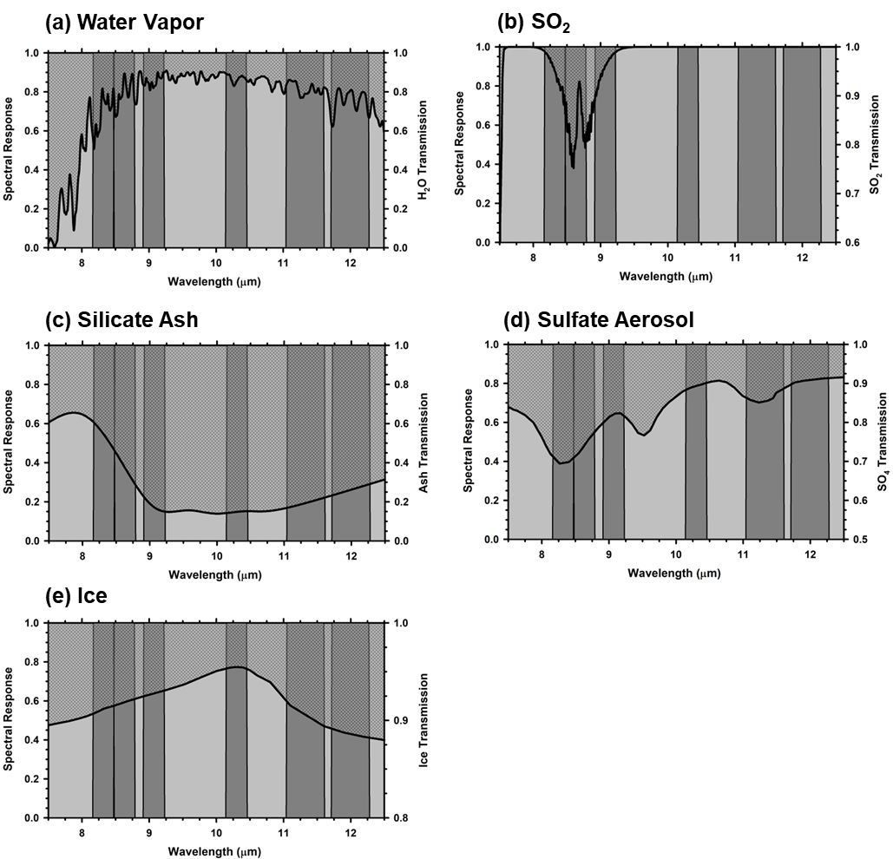

*Figure 2. Simulated transmission spectra for (a) water vapor, (b) sulfur dioxide (SO2), (c) silicate ash, (d) sulfate (SO4) aerosol, and (e) ice, superimposed on the nomi-nal positions of the OTTER TIR channels*

We do not measure the transmission of plumes directly and must infer the plume transmis-sion from the radiance at the sensor – or observed radiance - using radiative transfer (RT) model-ing. The atmosphere emits and absorbs TIR radiance (Fig. 3), and the observed radiance includes the radiance welling up through the atmosphere (path radiance) and fraction of down-welling, or sky, radiance reflected off the surface and transmitted back up to the sensor. The observed radiance is a function of many factors, including the satellite, or view, zenith angle (VZA), surface tempera-ture, emissivity, and elevation, plume altitude, or height, thickness, and SO2 concentration, and ver-tical distributions of atmospheric temperature and water vapor (H2O). These factors are input to the RT model to derive estimates of the observed radiance, and we vary the surface temperature and SO2 concentration to improve the fit between the observed and estimated radiance spectra.

Given the computational expense of RT modeling, investigators have developed strategies to map SO2 plumes without calling RT models during the retrieval process (e.g., Corradini et al., 2014; Pugnaghi et al., 2013, 2016; Piscini et al., 2014; Gabrieli et al., 2017). In general, these strat-egies are based on simulations (i.e., forward models) of observed radiance for ranges of model parameters, or model spaces, that best describe the states of plume properties, atmospheric conditions, and surface conditions during the observations. Depending on the specific approach, hundreds to millions of simulations are needed to generate look-up tables (LUT), derive para-metric expres-sions of TOA radiance vs. SO2 concentration, or train machine learning algorithms. Scaling for-ward-modeling strategies to global mapping is challenging due to the increases in the size and/or dimensions of the model space required to describe the variability of atmospheric conditions, sur-face conditions, and plume properties across the globe. Forward-modeling strategies are best-suited for monitoring specific volcanoes or studying specific volcanic events, as these applications pro-vide constraints on the size and dimensions of the model space.

### 3.2.	Global Mapping of Volcanic Plumes 
Our global mapping strategy will leverage key technological innovations developed for Plume Tracker, the JPL toolkit for the analysis of TIR spectra with interactive radiative transfer (RT) modeling (Realmuto et al., 1994, 1997; Realmuto and Worden, 2000; Realmuto and Berk, 2016). Specifically, we will retain the accurate modeling realized with free model parameters while improving the computational performance of the retrieval procedures. These innovations are sum-marized below.

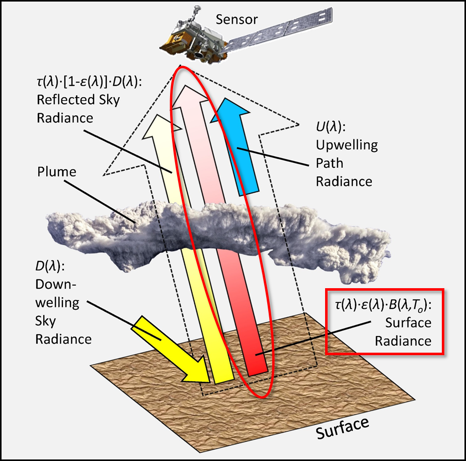

*Figure 3. Plume detection through transmission [t(λ)] based on the attenuation of surface radiance [ε(λ) B(λ,To)] passing through the plume enroute to the sensor:*

$$L(A, T_0) = f(\alpha) B(\alpha, T_0) + [1 - \alpha(\alpha)] D(0)^{\alpha}(T_0) + U(\lambda)$$

The observed radiance [L(λ,To ); outlined arrow] includes the surface radiance (red arrow), reflected downwelling sky radiance [D(λ), yellow arrow], and upwelling path radiance [U(λ), blue arrow]
Reconstruct Observed Radiance:
•	Transmission, sky radiance, and path radiance are estimated through radiative transfer (RT) modeling, cached, and re-used
•	Surface emissivity [ε(λ)] available from lab spectra, product archives, or calculated within scene
•	Surface temperature [To] estimated from radiance observations

### SO2 Index Map 

The SO2 Index (Krotkov et al., 2021) is a proxy for SO2 absorption, and indicates the most likely locations of SO2 plumes within a scene. We limit the RT modeling to the spectra from these locations, thereby minimizing the number of calls to the RT model. The Index is the brightness temperature difference (BTD) at 8.7 µm scaled between 2 and 15 K (Fig. 4). For OTTER, the Index is calculated as the difference between the BT in TIR-2 and the maximum BT across the remaining TIR channels. The cut-off at 2 K improves the discrimination of SO2 absorption from water vapor absorption, as water vapor absorbs more strongly at 8.7 µm than at 11 or 12 µm. The upper limit of 15 K captures all but the strongest SO2 absorption without saturating the Index. The SO2 Index also serves as mask, or screen, for ice-mode meteorological clouds.

To verify that the SO2 Index will be effective at detecting plumes over a wide range of plume heights and atmospheric conditions we processed VIIRS observations of plumes from Raikoke (Kurile Islands), Bardarbunga (Iceland), Lewotolo (Indonesia), and Kilauea Volcanoes (Fig. 4). This set of test cases features plumes in sub-Arctic and Tropical climate zones, at heights ranging from 2 to 13 km, and H2O content (expressed as total precipitable water) between 12 and 43 mm of H2O. Our analysis indicates that the scaling range for the SO2 Index (2 -- 15 K) provided successful plume detections for each test case.

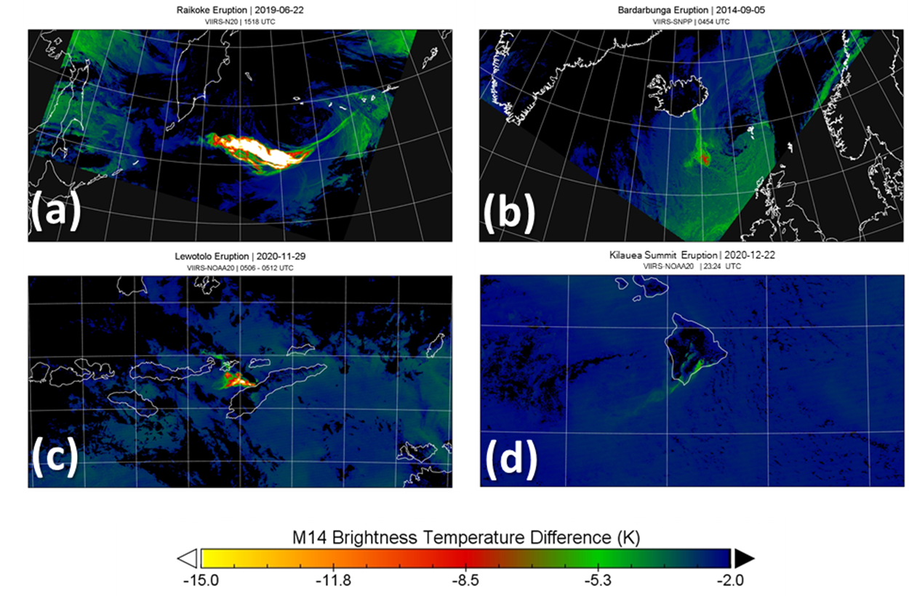
*Figure 4. The SO2 Index is a version of the BTD at 8.7 µm (VIIRS M14) scaled between 2 and 15 K. The cut-off at 2 K improves the discrimination of SO2 from water vapor (H2O) absorption, as H2O absorbs more strongly at 8.7 µm than at 11 or 12 µm. The upper limit of 15 K captures all but the strongest SO2 absorption without saturating the index. To test this range of scales, we analyzed VIIRS observations of plumes from (a) Raikoke (Kurile Islands), (b) Bardarbunga, (c) Lewotolo (Indonesia), and (d) Kilauea Volcanoes. This set of test cases features plumes in sub-Arctic and Tropical climate zones, at heights ranging from 2 to 13 km, and H2O content (expressed as total precipitable water) between 12 and 43 mm of H2O. The SO2 plumes were detected successfully in each test case.*

### Re-Use of Atmospheric Spectra 

Our retrieval procedures attempt to re-use model spectra generated by previous runs of the RT model before initiating a new run. The model spectra are cached as hash tables, or arrays of model spectra paired with an array of unique keys that index the spectral arrays. Each hash key is created by binning and concatenating the input parameters used to generate the corresponding model spectra. The hash key generated for an upcoming call to the RT model is compared against the keys compiled from previous calls and, if a match is found, the corresponding model spectra are returned to the retrieval procedure. If no matching key is found, the current key is added to the key array, the RT model is run, and the resulting spectra are cached to the hash tables.

Unlike a conventional LUT, the hash table is generated dynamically, and the number of entries in the table is limited to the number of unique combinations of input parameters required by the analysis. For example, the analysis of a scene depicting a plume over an ocean, requiring little change in the surface elevations input to the RT model, will require fewer entries in the hash table than an analysis of a plume over mountainous terrain.

### Reconstruction of Radiance Spectra 

Surface temperature and emissivity can vary widely within a satellite scene and, to promote the re-use of cached spectra, we exclude surface temperature and emissivity in the generation of hash tables. For a line-of-sight (LOS) through the atmosphere (Fig. 4), the observed TIR radiance, $$\text{L}_s$$, can be described with a simplified version of Eq. 1:

$$L_s(\lambda, T_o) = \varepsilon(\lambda) B(\lambda, T_o) + [1 - \varepsilon(\lambda)] L_d(\lambda) \tau(\lambda) + L_u(\lambda)$$

where \(T_{\text{o}}\) represents the surface temperature, ε(λ) represents the surface emissivity, B(λ, T~o~) represents the Planck Blackbody function, τ(λ) represents the spectral transmittance of the atmosphere, and $$ \text{L}_{\text{u}}(\lambda) $$ and $$ \text{L}_{\text{d}}(\lambda) $$ represent the upwelling path and downwelling sky radiance produced by the atmosphere. To simplify notation, we have omitted the functional dependence of these parameters on the VZA, and note that τ(λ), $$ \text{L}_{\text{u}}(\lambda) $$, and $$ \text{L}_{\text{d}}(\lambda) $$ are integrals over the LOS.

We cache the atmospheric spectra, τ(λ), $$ \text{L}_{\text{u}}(\lambda) $$, and $$ \text{L}_{\text{d}}(\lambda) $$, as described in the previous section. These spectra are not sensitive to surface temperature or emissivity and, when the retrieval procedures call for model radiance, we reconstruct the requested spectra from the corresponding atmospheric spectra, surface temperature, and emissivity. Radiance reconstruction increases the utilization of cached spectra to rates > 95%, meaning that fewer than five out of every 100 calls to the RT model require unique runs of the RT model.

### Transmission-Mode Retrievals 

The Transmission-Mode Retrievals are an extension of the Radiance Reconstruction approach. Conventional, or Full-Mode, RT modeling generates τ(λ), $$ \text{L}_{\text{u}}(\lambda) $$, and $$ \text{L}_{\text{d}}(\lambda) $$, and total LOS radiance spectra (Eq. 2), whereas Transmission-Mode RT modeling generates only τ(λ). The $$ \text{L}_{\text{u}}(\lambda) $$, and $$ \text{L}_{\text{d}}(\lambda) $$ spectra are necessary for the estimation of surface temperature. If we assume that these components are not sensitive to changes in SO2 concentrations, we can employ Transmission-Mode modeling and re-use the $$L_{\text{u}}(\lambda)$$, and $$L_{\text{d}}(\lambda)$$ spectra from our temperature estimations to reconstruct observed radiance for our estimations of SO2 concentration. Our testing of Transmission-Mode Retrievals (Fig. 5) indicate that we can achieve 25-50% reductions in processing time with no significant losses in accuracy.

 

*Figure 5. We are most interested in the absorption of surface radiance transmitted through the plume and can assume that the upwelling and downwelling atmospheric components are not sensitive to SO2 concentrations. Full-mode RT modeling generates the sky, path, and surface radiance, and is necessary for the estimation of surface temperature. Transmission-mode RT modeling generates LOS transmission, simplifying the calculations. Our comparison of simulated (a) Full-Mode and (b) Transmission-Mode Retrievals indicates no significant losses in accuracy.  In this simulation, the Transmission-Mode retrievals achieved a 47% reduction (141.7 vs. 267.5 s) in processing time.*

## Environmental Sources of Uncertainty

Given the dependence of observed radiance on properties of the surface and atmosphere, uncertainties in our knowledge of these properties will map into errors in our estimates of surface temperature and SO2 concentration. Here we describe our strategies for addressing these uncertainties.

### Surface Emissivity 

The 60-m spatial resolution of OTTER will allow us to map the source vents for SO2 plumes. With this ability, we must account for the effects of land surface emissivity on the observed radiance spectra (Fig. 4) and, ultimately, SO2 retrievals. The assumption of blackbody emissivity for exposed, or non-vegetated, surfaces will often lead to false detections of SO2. The problem of false detections is most significant in arid regions, which feature quartz-rich sand and sulfate-rich dry lake deposits. At the coarse spectral resolution of SBG, the emissivity spectra of quartz sand and sulfate minerals are very similar to the absorption spectrum of SO2 (Fig. 6).

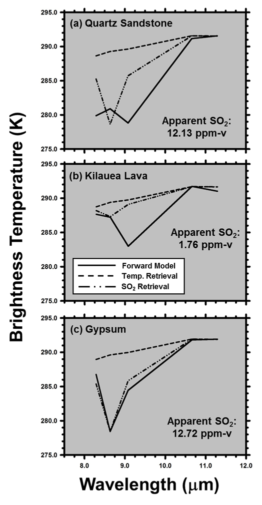 
 
 *Figure 6.  Surface emissivity is a confounding factor for SO2 detection, as demonstrated by model spectra (solid lines) generated for SO2-free atmospheric profiles over simulated surface compositions of (a) quartz sandstone, (b) pahoehoe lava from Kilauea Volcano, and (c) gypsum. Assuming the surfaces are blackbodies (emissivity = 1), attempts to fit the model spectra by varying only surface temperature fail (dashed lines). The fit improves if SO2 is introduced as a free parameter (broken lines), with the penalty of false, or apparent, SO2 detections. The false detections are largest for sandstone and gypsum, due to the overlap between emissivity minima and SO2 absorption. As a rule, the assumption of black-body emissivity for exposed (non-vegetated) surfaces will lead to false detections of SO2.*

We demonstrate the impact of emissivity on SO2 retrievals by simulating radiance spectra for surfaces composed of quartz sandstone, pahoehoe lava from Kilauea Volcano (Hawaii), and gypsum (Fig. 6). In each case, we generated radiance spectra for SO2-free atmospheric profiles and then estimated the surface temperature and SO2 column density with the assumption that the surface was a perfect emitter (emissivity = 1), or blackbody. This assumption is common in cases where the surface emissivity is not known and is explicit in the conversion of radiance spectra to brightness temperature spectra.

The impact of the blackbody assumption on radiance (Fig. 6) is indicated by the misfit between the surface temperature retrievals (dashed lines) and forward models (solid lines). We can improve the fit by adding SO2 to the atmospheric profiles, with the penalty of false, or apparent, SO2 retrievals. The impact of the blackbody assumption on SO2 retrievals is most acute in cases where minima in the surface emissivity spectra overlap the absorption spectrum of SO2. Accordingly, the emissivity effects, quantified as apparent SO2 retrievals, are larger for quartz sandstone (Fig. 6a) and gypsum (Fig. 6c) than the Kilauea lava (Fig. 6b).

We can minimize the impact of surface emissivity on the detection of SO2 through an explicit correction for surface emissivity, as demonstrated with VIIRS data from Mt. Etna, Sicily (Fig. 7). The SO2 Index delineates the plume (yellow circle, Fig. 7a), but we find much larger index values - indicating larger BTD - over North Africa due to deposits of quartz-rich sand. We eliminate most of the emissivity related BTD enhancements by dividing the observed radiance spectra by emissivity spectra prior to calculating the BTD (Fig. 7b). The emissivity correction did not eliminate the enhancement of BTD due to H2O absorption, which was stronger at the margins of the scene (VZA ≥ 50°) due to the longer optical paths through the atmosphere. We attenuate the BTD at the scene margins by applying a gradient, or ramp, as a function of VZA (Fig. 7b). The ramp function preserves some of the information in the scene margins, as opposed to cutting off the BTD associated with larger VZA.

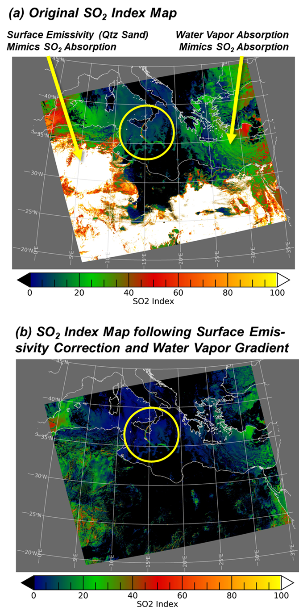 
 
 *Figure 7. Surface emissivity and water vapor (H2O) absorption are confounding factors for SO2 detection, as demonstrated by VIIRS-N20 TIR data acquired over Mount Etna on 27 Dec 2018 at 11:48 UTC.  (a) The emissivity of quartz sandstone (Fig. 5a), together with water vapor absorption (Fig. 1a), mimic SO2 absorption and result in false detections of SO2. (b) We minimize the false detections by applying emissivity correction and a gradient function scaled to the satellite, or view, zenith angle (VZA).*

We simulated VIIRS (NOAA20) emissivity spectra for this scene from the Combined ASTER MODIS Emissivity over Land (CAMEL) database (Loveless et al., 2021; Borbas et al., 2018; Feltz et al., 2018). The global CAMEL spectra are available as a monthly climatology for the Years 2000 -- 2016, with a grid spacing of \~5 km. For the PGS we will generate custom emissivity databases corresponding to the spectral channels of OTTER, and then provide emissivity spectra to the PGS on demand by indexing the databases by time (i.e., month) and location.

We will use the CAMEL climatology to describe surface emissivity at the start of the SBG mission, gradually replacing the CAMEL spectra with a climatology of OTTER emissivity spectra. The time dimension of the climatology is critical, as we will average the OTTER spectra over time to generate "plume-free" maps of surface emissivity. Emissivity spectra calculated for lines-of-site (LOS) through a plume will map the absorption of radiance by SO2 into the derived emissivity spectra. An SO2 retrieval based on the use of such corrupted emissivity spectra would report zero SO2 in the LOS.

### Atmospheric Temperature and Humidity

Atmospheric profiles of temperature and water vapor (H2O) content are critical inputs to the retrieval procedures, as these properties define the temperature of entrained SO2 plumes and the control the transmission and emission of radiance in the atmosphere. Atmospheric profiles are available from a variety of sources, as we demonstrate (Fig. 8) with a comparison of profiles measured with a radiosonde launched from Hilo, Hawaii (6 May 2018, 00:00 UTC), derived from AIRS and MODIS data, and output from the Modern-Era Retrospective Analysis for Research and Applications, or MERRA-2, reanalysis (Rienecker et al., 2011).

The agreement between the derived and model temperature profiles and the radiosonde temperature profile is very good (Fig. 8a), although neither the radiosonde nor the MODIS profiles provide temperature information for altitudes above 35 km (red circle). However, there are significant differences between the H2O profiles. At the altitude of 2 km (a typical altitude for Kilauea plumes) the MERRA-2 reanalysis (Fig. 8b) over-estimated the H2O by 22%, relative to the Hilo radiosonde, and the MODIS and AIRS profiles (Fig. 8c) under-estimated the H2O by 56%. The overestimation of H2O led to overestimation of SO2, and the under-estimation of H2O led to under-estimation of SO2.

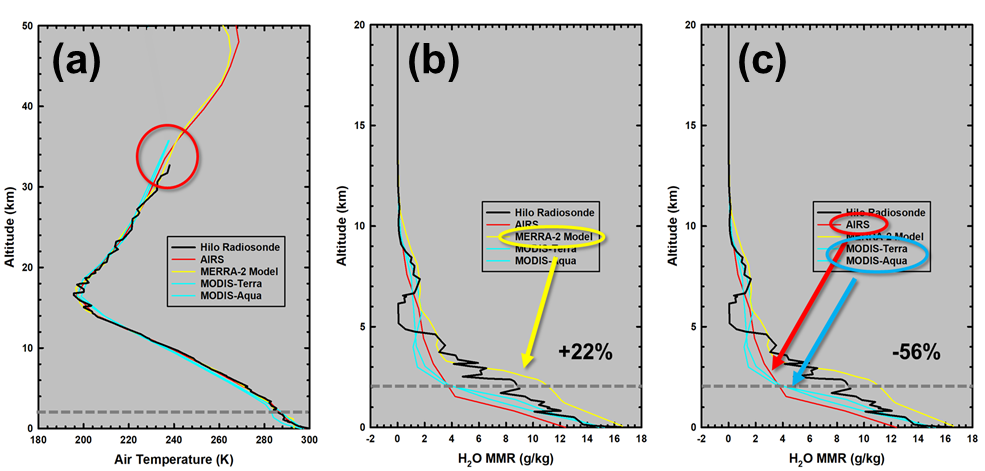 

*Figure 8. Uncertainties in our knowledge of atmospheric temperature and H2O content translate into uncertainties in our SO2 estimates. Here we compare temperature and H2O profiles measured by a radiosonde launched from Hilo, Hawaii (6 May 2018, 00:00 UTC) with corresponding profiles derived from AIRS (red) and MODIS (blue) data and model output from MERRA-2 reanalysis (yellow). (a) The derived and model temperature profiles agree well with the radiosonde temperature profile. Neither the radiosonde nor the MODIS profiles provide temperature information for altitudes above 35 km (red circle). The estimation of water vapor is more challenging. (b) The MERRA-2 reanalysis over-estimates the H2O at 2 km (dashed line), a typical altitude for Kilauea plumes, by 22%, relative to the radiosonde. (c) The MODIS and AIRS profiles under-estimate the H2O by 56%.*

Recognizing that we will never have perfect knowledge of atmospheric conditions, we will opt for the consistent and easily accessible atmospheric profiles provided by numerical weather prediction (NWP) models. Specifically, we will incorporate the Forward Processing for Instrument Teams (FP-IT) products distributed by the NASA Global Modeling and Assimilation Office (GMAO) as part of the Goddard Earth Observation System Version 5 (GEOS-5) family of models. GEOS-5 FP-IT was designed specifically to provide long-term and reproducible characterization of atmospheric conditions for instrument science teams, and current clients of FP-IT include MODIS, OMI, OMPS, and the Ecosystem Spaceborne Thermal Radiometer Experiment on Space Station (ECOSTRESS). FP-IT will also support retrospective analyses of historic satellite data records.

The use of model output to characterize atmospheric conditions has another advantage for our retrieval procedures. Temperature and H2O profiles derived from satellite data will be corrupt-ed by the presence of SO2 plumes and met clouds, and such corruption will defeat our procedures to detect SO2 plumes and met clouds. Although we can screen the satellite-based profiles for quality flags indicating corruption by plumes or clouds, such screening may well leave us with no atmospheric profiles in the vicinity of the targeted volcanoes. The FP-IT model output represents an idealized state of the atmosphere that is well-suited for our plume detection procedures.

### Plume Altitude 

The strength of SO2 absorption is a function of the gas concentration within a plume and the contrast between the temperatures of the plume and underlying radiating surface. The impacts of gas concentration and temperature contrast on absorption are inversely proportional, so we must specify the plume temperature when estimating SO2 concentrations. The down-wind, or entrained, portions of plumes are in thermal equilibrium with the surrounding atmosphere, and we assign the plume temperature to the air temperature at plume height, as described by the input profile of atmospheric temperature.

 

*Figure 9. TIR-based estimates of SO2 column density are sensitive to the model altitude, or height, of the plume, as demonstrated by this analysis of VN20 data for the recent eruption of Kilauea Volcano. A decrease in model plume height from (a) 2.7 to (b) 1.52 km resulted in the loss of ~ 1 x 106 kg of SO2 from the apparent Total Mass.*

We illustrate the impact of plume height on SO2 estimates with an analysis of VIIRS observations of Kilauea Volcano on 22 Dec 2020, during the recent renewal of eruptive activity at the summit (Fig. 9). A decrease in the model plume height from 2.7 (Fig. 10a) to 1.5 km (Fig. 9b) resulted in a gain of \~1 x 10^6^ kg of SO2 in the resulting estimates. The decrease in plume altitude increased the plume temperature from 282 to 287 K, thus reducing the contrast between the plume and surface temperatures. As the temperature contrast decreases, more SO2 is required to produce the observed absorption.

For most situations, the plume heights will not be known prior to the automated PGS processing. To accommodate the potential range in plume heights we will derive SO2 estimates at model heights of 0.9, 2.5, 7.5, and 17 km. These model heights are the same heights, or centers-of-mass altitude (CMA), employed in generating SO2 estimates from OMI and OMPS observations \[Li et al., 2013; 2017\]. By matching up the model heights, we will facilitate our comparisons between TIR- and UV-based SO2 retrievals.

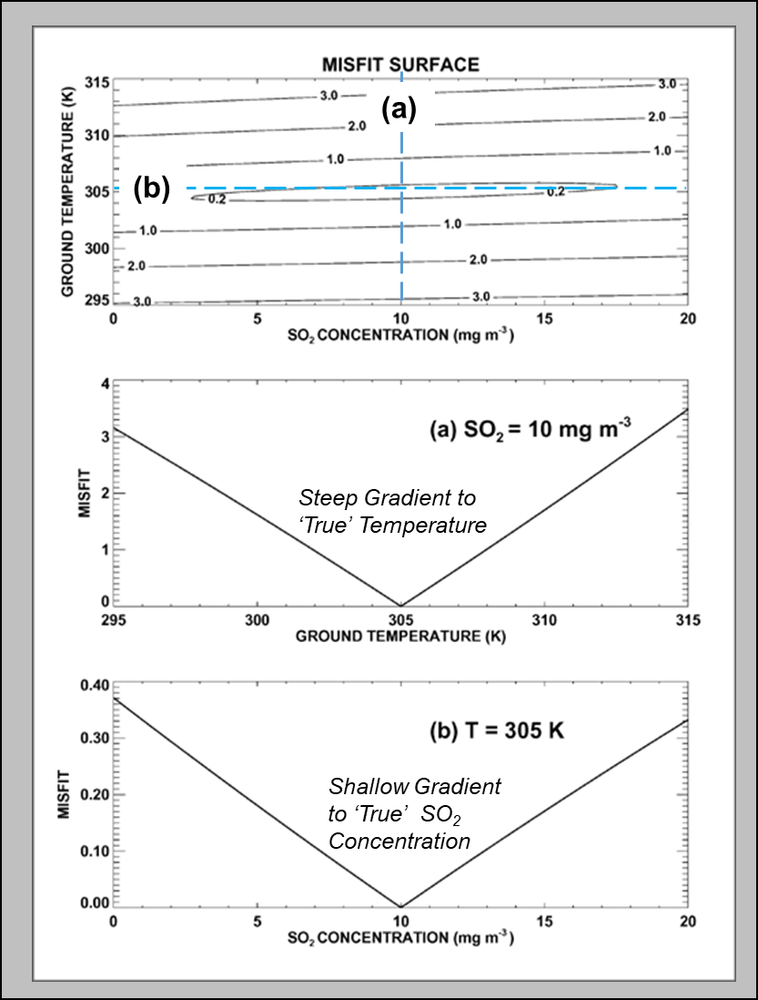 

*Figure 10. Misfit surface demonstrates the influence of surface (ground) temperature and SO2 concentration on observed radiance. (a) The temperature is well-constrained by the observations, as shown by a profile parallel to the temperature axis. The misfit surface has steep gradients to the “true” surface temperature (305 K). (b) The SO2 concentration is poorly constrained, by the observations, as shown by a profile parallel to the SO2 axis. The misfit surface has shallow gradients, 10x shallower than the temperature gradients, to the “true” concentration (10 mg/m3). The lack of constraint on SO2 concentration is a challenge for the simultaneous estimation of temperature and concentration. Our 2-step approach is to estimate the temperature corresponding to a SO2 concentration of 0 and then use this temperature to estimate the concentration.*

## Estimation of Surface Temperature and SO2 Concentration

As we demonstrated in the previous section, the absorption of SO2 is a function of both the temperature contrast (parameterized by surface temperature) and SO2 concentration. Here we explore the estimation of surface temperature and SO2 concentration from a radiance measurement in a single channel centered at 8.5 μm (analogous to TIR-2). Figure 10 depicts the least squares misfit between a radiance spectrum calculated with a surface temperature of 305 K and SO2 concentration of 10 mg m^-3^, and radiance spectra calculated for ranges of temperatures and concentrations that are centered on the true input values.

The misfit surface resembles a flat-bottomed valley aligned parallel to the SO2 concentration axis, with a steep gradient to the input surface temperature (Fig. 10a) and shallow gradient to the input SO2 concentration (Fig. 10b), indicating that surface temperature is well-constrained by the radiance but the SO2 concentration is poorly constrained. We address this difference in the constraints on input parameters by estimating the surface temperature and SO2 concentration in separate steps. In practice we use the full spectrum of observed radiance, rather than a single channel, to estimate surface temperature and SO2 concentration, and the transparency of an SO2 plume at wavelengths longer than 9.5 μm (Fig. 2b) facilitates the estimation of the surface temperature.

### Inputs to Estimation Procedures

The principal input data for the estimation procedures are Level 1B (L1B) products and, for the sake of brevity, we incorporate observed radiance, VZA, DEM, and geolocation products into the category "L1B products." Of the remaining inputs, the SO2 Index Map is generated from L1B radiance, while the CAMEL emissivity database and atmospheric temperature and H2O profiles are independent of L1B.

### Product Generation System (PGS)

Here we present an overview of the Product Generation System, or PGS (Fig. 11), followed by more detailed discussions of components of the system. We demonstrate the processing flow with an analysis of MODIS-Aqua (MYD) observations of Bardarbunga Volcano on 5 September 2014.

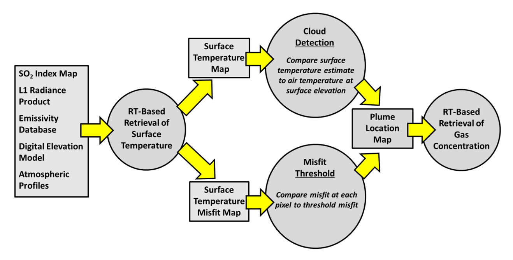 
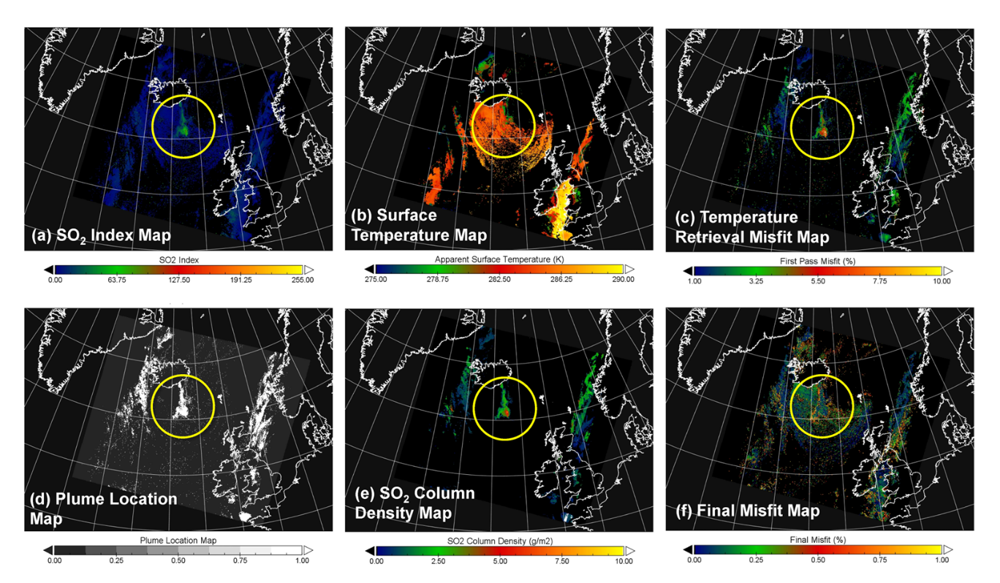 

*Figure 11. Demonstration of the Product Generation System (PGS) with MYD observations of the Bardarbunga Eruption on 5 Sept 2014 (03:25 UTC). The SO2 Index Map (a), based on BTD, restricts the initial RT modeling to likely plume locations. The Surface Temperature Map (b) is based on RT modeling that does not incorporate the presence of plumes or meteorological (met) clouds. The Misfit Map (c) that results from temperature estimation indicates the location of plumes and met clouds. The Plume Location Map (d), based on cloud-screening and thresholding of misfit values, restricts the RT-based estimation of SO2 Column Density (e) to the most likely plume locations. The plume locations are not apparent in the Surface Temperature (b) or Final Misfit Maps (f), indicating that the temperature and SO2 estimates were not biased systematically.*

The SO2 Index Map (Fig. 11a) restricts the initial round of RT modeling to likely plume locations and, in this example, eliminates 78% of the pixels in the MYD scene from further consideration. Our estimation of surface temperature (Fig. 11b) requires a single Full-Mode run of the RT model. We do not consider the presence of volcanic plumes or meteorological (met) clouds when estimating temperature and, accordingly, the temperature misfit map (Fig. 11c) indicates the locations of plumes and met clouds.

The SO2 Index Map is a screen for ice-mode clouds, but we must separate water-mode clouds from volcanic plumes explicitly. We identify water-mode clouds through comparison of the surface temperature estimates (T~o~) with the air temperature at surface elevation (T~air~), as defined by the input temperature profile and DEM. We flag locations where T~air~ ≥ T~o~ as locations where the surface was obscured by met clouds or the optical depth of the plumes was too high to transmit ground-leaving radiance. In practice, we assign thresholds to the difference (T~air~ -- T~o~) to accommodate variability in cloud optical depth and atmospheric conditions.

We combine the cloud detections and temperature misfit map (Fig. 11c) to construct a plume location map (Fig. 11d) which, in this example, eliminates 93% of the pixels in the scene from further consideration. The second, and most expensive, round of RT modeling is limited to the plume locations, producing maps of SO2 column density (Fig. 11e) and final misfit (Fig. 11f). The estimation of SO2 requires multiple Transmission-Mode runs of the RT model.

The absence of expressions of plume locations in the Surface Temperature Map (Fig. 11b) indicates that the Bardarbunga plume was transparent in at least one of the MYD channels and the surface temperature estimates were not biased by the optical depth of the plume. The absence of expressions of plume location in the Final Misfit Map (Fig. 11f) indicates that the corresponding retrieval results were not biased systematically.

### Output Data 

The VA algorithm will run on the L2 surface radiance data over a 50 km by 50 km region of interest (ROI) centered on the world's \~ 1500 most (and potentially) active volcanoes (*REF*). Initially, the decorrelation stretch (DCS), SO2 Index, and Ash Index images are produced and used as a gateway test for more rigorous species retrievals. If either ash or SO2 are detected in the index images, the algorithm will implement the radiative transfer (RT) modeling to produce the following data layers: SO2 Column Density -- PBL, SO2 Column Density -- TRL, SO2 Column Density -- TRM, SO2 Column Density -- STL, and SO2 Uncertainty (see Table 4).

# Thermal Flux: Theory and Methodology

## Thermal Anomaly Detection

The data from spaceborne sensors have been used to detect and monitor volcanic eruptions and wildfires from the earliest days of the satellite era (e.g., Gawarecki et al., 1965; Williams and Friedman, 1970; Scorer, 1986). These studies focused mostly on hot spot detection and temperature measurements using TIR data. They became ever more complex with the launch of new sensors providing better spatial, temporal, and spectral data. For example, the ability to extract critical information from the subtle phases of precursory activity to the detailed spectral mapping of the erupted products grew exponentially (Ramsey and Harris, 2013).

The ever increasing amount of orbital data has resulted in a wide range of temporal and spatial scales with a large number of algorithms designed to automatically detect pixels that are deemed "thermally anomalous". These detection algorithms are commonly rooted in analysis of the spatial, spectral, and/or temporal (or some combination thereof) scales of the data. For example, an algorithm may use the change in temperature of a region over time to identify the appearance of a thermal anomaly (e.g., Tramutoli et al. 1998), whereas other approaches determine the radiance difference between bands (e.g., Wright et al., 2002), or that spectral changes over a spatial area (Coppola et al., 2016) to identify an elevated temperature feature (e.g., Figure 1).

Whether a thermal anomaly detection algorithm operates by assessing radiance (or temperature) in spectral, spatial, or temporal space, the methods can be divided into four categories: fixed threshold, contextual, temporal, or hybrid. Fixed threshold algorithms are spectrally based and use data for a single pixel to assess whether the radiance (or temperature) in the MIR and/or TIR bands is thermally anomalous. In contrast, contextual algorithms use the difference between a pixel's radiance (or temperature) and that of its surrounding pixels (e.g., "the background temperature") to assess its state. Temporal algorithms operate by comparing a pixel's radiance (or temperature) with the preceding historical values for the same pixel over time. These time series allow typical pixel values for any given time of day and year to be defined, and divergences from the baseline to be statistically assessed. However, by definition, they rely on prior data and become more appropriate with increasing mission durations. More recent algorithms have incorporated aspects of one or more of these three categories and are dubbed hybrid approaches. Many of these algorithms are now benefiting from the application of Artificial Intelligence (AI) models to improve these prior statistical approaches (*REFS*).

## The ASTAD Algorithm

ASTAD is the most complex statistically based approach that automatically detects the entire temperature range of thermal anomalies in both day and night ASTER TIR data (Ramsey et al., 2023). Significantly, ASTAD also produces a very low percentage of false positives and is excellent for extracting subtle (\< 2 K) thermal anomalies. The algorithm contains four main steps: (1) image pre-processing, (2) background normalization, (3) Gabor-based filtering, and (4) anomaly identification. It also addresses issues that historically have plagued past algorithms applied to high spatial resolution TIR data (e.g., clouds, gas plumes, solar-heated slopes in daytime TIR data, etc.).

Machine Learning (ML) modeling has been applied to the ASTAD data using a convolutional neural network (CNN) deep learning model, whose structure is inspired by the brain\'s primary visual cortex allowing it to replicate the way in which it detects thermal anomalies in an image (Corradino et al., 2023). CNN exploits deep, locally connected layers to extract discriminative features (e.g., the spatial distribution of thermal anomalies) and classifies pixels in anomalies and background. The ML model is a supervised CNN, i.e. UNET (Ronneberger et al., 2015), and it was trained on ASTER TIR Band 13 (10.25--10.95 µm) data using the results from the original ASTAD study (Ramsey et al., 2023) for the labeling phase. More information about the performance of the ASTAD and ML approach are available in the L3 ETF ATBD.

### Heat Flux

The radiative heat flux of volcanic surfaces (e.g., edifices, lava domes, lava flows, plumes) are calculated with respect to surface kinetic temperature and emissivity. The methods used to calculate the radiant flux follow prior approaches described using satellite and ground based TIR datasets (Harris, 2013). Radiant heat fluxes (Φ~rad~) are calculated using the OTTER derived surface temperature (T~s~), ambient surface temperature (T~a~), and spectral emissivity (ε):

$$L(A, T_0) = f(\alpha) B(\alpha, T_0) + [1 - \alpha(\alpha)] D(0)^{\alpha}(T_0) + U(\lambda)$$

where σ is the Stefan-Boltzmann constant in Wm^−2^ K^−4^ and A is pixel area in m^2^.

The background surface temperatures are derived using the ASTAD algorithm through the use of an annulus approach for each scene screened. The annulus is characterized by an inner and outer radius that is grown outward from the volcano\'s summit, and the median absolute deviation (MAD) is computed for each annulus iteration (i.e., increase in radius pixel by one). The optimal background annulus has the lowest dispersion values (local minimum of the MAD trend) after extending beyond the 2-sigma (87% percentile) maximum in the MAD trend. The annulus area is centered on the summit (Murphy et al., 2011), but no further constraints are made based on summit elevation, edifice size, season, or time of day. The inner and outer radius of the annulus vary for each scene so as not to encroach on any anomalous pixels. Specifically, the inner radius is located on the outside of the most distal thermal anomaly detected, with the outer radius located ∼450 m from the inner radius position. This produces a minimum background area of \~338 OTTER TIR pixels (1.22 × 10^6^ m^2^) with an average of ∼900 pixels (3.24 × 10^6^ m^2^), which is statistically large for the scale of OTTER data (Vaughan et al., 2010). The background temperature value for each scene (T~a~) is the mean value of the circle area minus any outlying values.

The size of the background area varies dynamically depending on the volcanic activity, from a smaller region closer to the summit for several thermally elevated pixels in the crater, for example, to a larger number extending to neighboring topographic peaks at similar elevations and orientations, for much larger anomalies like long lava flows (Carter et al., 2009; Pieri and Abrams, 2005; Raheja et al., 2013; Ramsey and Dehn, 2004). Importantly, these areas account for a range of background temperatures that are influenced by solar heating from variations in slope, aspect, and solar azimuth (Carter et al., 2009; Murphy et al., 2011; Vaughan et al., 2010). Because of the complications of solar heating sometimes producing temperatures higher than the actual anomalies themselves, many prior algorithms only focus on nighttime TIR data. However, this severely limits the data availability for higher spatial resolution sensors like OTTER. Therefore, the adoption the annulus approach to derive a background area independent to the volcano\'s orientation with respect to the sun and size of the anomaly, allows the accurate integration of daytime data. The background temperature derived from the annulus is subtracted from the surface temperature of each detected anomalous pixel to produce the temperature above background (TAB).

### Output Data

T.B.D. once final algorithm choice is determined

# Volcanic Activity (VA) Algorithm

## Operational Workflow

T.B.D. once final algorithm choice is determined

## Output Data Layers

T.B.D. once final algorithm choice is determined

## Low Latency

The VA will also be produced as a low latency (LL) product available within 24 hours of data acquisition. Unlike the full L4 product, the LL-VA will operate on the radiance-at-sensor data and only produce the DCS and two index maps (ash and SO2) over targets with a positive detection. Without atmospheric correction, the uncertainty is expected to be higher.

1.  **Uncertainty Analysis**

    1.  **Plume Tracker Sensitivity to Plume Height and Water Vapor**

Figure 12 shows the results of simulations to assess the sensitivity of surface temperature and SO2 retrievals to temperature contrast (parameterized as vertical plume top height, or VPTH) and total column water vapor (H2O). The RMS combination of uncertainties due to VPTH and H2O is 12%, and the real-world uncertainty is likely closer to 15%.

The simulations were based on the 27 Dec 2018 eruption plume from Mount Etna, Trapani (Sicily) radiosonde profile for the lower atmosphere, and AIRS atm profile for the upper atmosphere. The inputs to the forward model were as follows:

-   VPTH: 4.5 km

-   Plume Thickness: 1 km

-   Surface Temperature: 290.0 K

-   SO2 Concentration: 2.5 ppm

The temperature estimation procedure is weighted to prevent underestimates (Fig. 12a), and the estimates are insensitive (± 0.4%) to the plume height. Decreasing water vapor (Fig. 12b) increases atmospheric transmission, and lower surface temperatures are required to produce the observed radiance. Conversely, increasing water vapor decreases transmission and higher surface temperatures are required to produce the required radiance. However, the estimation errors are less than 0.5%.

The SO2 estimates are very sensitive to the temperature contrast (Fig. 12c). The errors increase (up to 40%) with decreasing plume height, which results in decreasing temperature contrast.

 

*Figure 12. Sensitivity of surface temperature (top row) and SO2 concentration (bottom row) to errors in our knowledge of plume height (left column) and atmospheric water vapor (right column). The true values for height and water vapor scaling factor are indicated with the vertical lines. We use plume height to parameterize the temperature contrast between the plume (assumed to be at ambient air temperature) and underlying surface. (a) The temperature estimation procedure is weighted to prevent underestimates, and the estimates are insensitive (± 0.4%) to the plume height. (b) Decreasing water vapor increases atmospheric transmission and lower surface temperatures are required to produce the observed radiance. Conversely, increasing water vapor decreases transmission and higher surface temperatures are required to produce the required radiance. However, the estimation errors are < 0.5%. (c) The SO2 estimates are very sensitive to the temperature contrast. The errors increase (up to 40%) with decreasing plume height, which results in decreasing temperature contrast. The errors decrease (< 20%) with increasing plume height, which results increasing temperature contrast. (d) The apparent decrease surface temperature due to decreasing water vapor increases the SO2 estimates. Conversely, the apparent increase in surface temperature due to increasing water vapor decreases the SO2 estimates. The maximum estimation error approaches 20% but is generally < 10%.*

The errors decrease (\< 20%) with increasing plume height, which results increasing temperature contrast. The apparent decrease surface temperature due to decreasing water vapor increases the SO2 estimates (Fig. 12d). Conversely, the apparent increase in surface temperature due to increasing water vapor decreases the SO2 estimates. The maximum estimation error approaches 20% but is generally less than 10%.

1.  **ASTAD Sensitivity to NEDT**

The OTTER instrument is anticipated to have an NEΔT of 0.2 K at 300 K, which corresponds to an average NEΔL of 0.030917 Wm^-2^sr^-2^µm^-1^. To evaluate the sensitivity of the algorithms to a reduction in instrument performance on orbit the NEΔT is increase to 1.0 K at increments of 0.2 K.

 

*Figure 13: Modeled SBG NEΔT versus scene temperature for the two MIR and six TIR bands with time delay integration (TDI).*

The results of degradation in instrument performance on-orbit are shown in figure 14. For ASTAD a decrease in OTTER instrument performance would result in a slight decrease in precision (\<2%) but a significant increase in F1 score and Recall (\<35%). A decrease in on-orbit OTTER instrument performance from 0.2 to 1.0 K NEΔT would result in accuracy and precision metrics remaining mostly constant within ±7% (Figure 14).

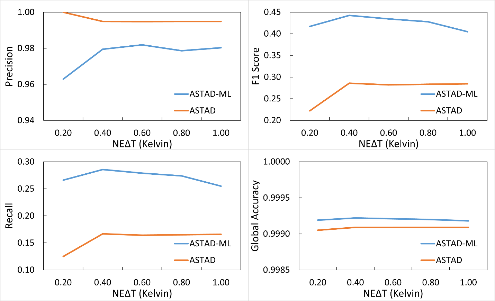 

*Figure 14: The algorithm detection precision and accuracy changes in ASTAD and ASTAD-ML as a result of OTTER instrument on-orbit performance degradation. *

2.  **Total Uncertainty**

T.B.D. once final algorithm choice is determined

# Scientific Data Set (SDS) Variables

|  **SDS** | **Long Name** | **Data type** | **Units** | **Valid Range** | **Fill Value** | **Scale Factor** | **Offset** |   **Group**  | **SDS** |
| --- | --- | --- | --- | --- | --- | --- | --- | --- | --- |
|  VAI | Volcanic Activity Index  |  Uint8     |   0-100     |        |            0       |                            
|  DCS     |    DCS Image       |           24-bit color  |  n/a   |    |                    0         |                          
|  SO2I    |    SO2 Index        |          Int8      |      n/a      |      |               0          |                         
|  AshI    |    Ash Index         |         Int8       |     n/a       |     |               0         |                          
|  Anom |       Anomaly Detection    |     Int8      |      n/a      |      |               0         |                          
|  Tbkg  |      Background Temperature   |  Float32  |       K     |         |               0          |                         
|  Tele   |     Elevated Temperature    |   Float32    |     K      |       |                0           |                        
|  HF      |    Heat Flux          |        Float32  |       MW      |       |               0            |                       
|  SO2-PBL  |   SO2 Column Density - PBL |  Float32   |      g/m^2^  |      |                0             |                      
|  SO2-TRL  |   SO2 Column Density - TRL |  Float32  |       g/m^2^     |    |               0                                   
|  SO2-TRM  |   SO2 Column Density - TRM  | Float32  |       g/m^2^   |       |              0       |                            
|  SO2-STL  |   SO2 Column Density - STL |  Float32   |      g/m^2^    |       |             0       |                            
|  SO2-U    |   SO2 Uncertainty    |        Float32   |      g/m^2^    |        |            0        |                           
|  DQ      |    Data Quality       |        Int8       |     n/a       |         |           0         |                          

*Table 4. The Scientific Data Sets (SDSs) for the SBG L4 VA product.*

# Calibration/Validation Plans

Plume Tracker, together with its predecessor MAP_SO2, are the heritage for the PGS. The retrieval procedures have been evaluated rigorously through simulation-based sensitivity analyses (Realmuto et al., 1994, 1997; Realmuto, 2000), multi-sensor comparisons (Realmuto and Worden, 2000; Kearney et al., 2009; Thomas et al., 2009, Realmuto and Berk, 2016; Corradini et al., 2021), and comparisons with ground-based measurements (Realmuto and Berk, 2016).

We will continue this testing regime with OTTER-based product. Intercomparisons between retrievals based on OTTER and those based on other instruments are the most practicable validation exercises. The minimum requirement is that the OTTER retrievals should agree with retrievals based on another TIR sensor when the data are processed with the same retrieval algorithms. Figure 14 illustrates a favorable intercomparison between MODIS- and VIIRS-based retrievals generated by Plume Tracker.

A more rigorous validation is the intercomparison of retrievals from different instruments generated with different algorithms. Figure 15 contains the results of a multi-sensor intercomparison covering a four-day period (26-30 December 2018) during the 2018 "Christmas" Eruption of Mount Etna (Corradini et al., 2021). The VIIRS-based retrievals (blue squares), generated with Plume Tracker, are in excellent agreement with the retrievals based on near-continuous observations from the SEVIRI instrument (gray bars).

Mount Etna will be the principal site for validation of our OTTER SO2 retrievals. We will leverage the exceptional satellite data processing and ground-based monitoring resources of the National Institute of Geophysics and Volcanology (INGV), as described recently by Corradini et al. (2020; 2021). We will access the near real time (NRT) SO2 retrievals derived from SEVIRI

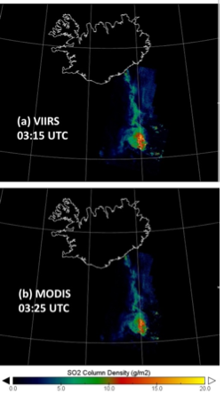 

*Figure 15. Validation of retrieval procedures through inter-comparison of results from different instruments. SO2 retrievals based on (a) VIIRS-SNPP and (b) MODIS night-time observations of the Bardarbunga plume are virtually identical. The column density estimates were derived from observations acquired within a 10-min interval on 5 Sept 2014. For both sets of retrievals, the ambient atmospheric conditions were described with AIRS L2 profiles.*

data, which flies on the geostationary Meteosat Second Generation (MSG) platform, and Flux

Automatic Measurements (FLAME) network of upward-looking UV spectrometers installed on the flanks of Mount Etna. The SEVIRI observations are acquired every 15 min (Fig. 15), and INGV estimates SO2 column density, ash loading, and plume height continuously from the SEVIRI TIR radiance measurements. The FLAME network scans the sky every five minutes over day-time periods of \~9 h. This continuous monitoring ensures that we will have SEVIRI and FLAME coverage for all our daytime overpasses of Mount Etna (weather and viewing conditions permitting), and SERIVI coverage for night-time overpasses.

 

*Figure 16. Inter-comparison of SO2 retrievals based on TIR data from SEVIRI, MODIS, VIIRS, AIRS, and IASI and UV data from TROPOMI. The study covered a four-day period (26 – 30 December 2018) during the 2018 ‘Christmas’ Eruption of Mt. Etna. The VIIRS-based retrievals (blue squares), generated with Plume Tracker, are in excellent agreement with the retrievals based on near-continuous observations from the geostationary SEVIRI instrument (gray bars). Figure modified from Corradini et al. (2021).*

## Standard Metadata

Each SBG product bundle contains two sets of product metadata:
-   ProductMetadata
-   StandardMetadata

Each product contains a custom set of `ProductMetadata` attributes, as listed in Table 5. Information on the standard product metadata is included on the [SBG-TIR github landing page

| **Name** | **Type** |
| --- | --- |
| AncillaryInputPointer | string |
| AutomaticQualityFlag | string |
| AutomaticQualityFlagExplanation | string |
| BuildID | string |
| CRS | string |
| CampaignShortName | string |
| CollectionLabel | string |
| DataFormatType | string |
| DayNightFlag | string |
| EastBoundingCoordinate | float |
| FieldOfViewObstruction | string |
| ImageLines | float |
| ImageLineSpacing | integer |
| ImagePixels | float |
| ImagePixelSpacing | integer |
| InputPointer | string |
| InstrumentShortName | string |
| LocalGranuleID | string |
| LongName | string |
| NorthBoundingCoordinate | float |
| PGEName | string |
| PGEVersion | string |
| PlatformLongName | string |
| PlatformShortName | string |
| PlatformType | string |
| ProcessingEnvironment | string |
| ProcessingLevelDescription | string |
| ProcessingLevelID | string |
| ProducerAgency | string |
| ProducerInstitution | string |
| ProductionDateTime | string |
| ProductionLocation | string |
| RangeBeginningDate | string |
| RangeBeginningTime | string |
| RangeEndingDate | string |
| RangeEndingTime | string |
| RegionID | string |
| SISName | string |
| SISVersion | string |
| SceneBoundaryLatLonWKT | string |
| SceneID | string |
| ShortName | string |
| SouthBoundingCoordinate | float |
| StartOrbitNumber | string |
| StopOrbitNumber | string |
| WestBoundingCoordinate | float |

*Table 5. Name and type of metadata fields contained in the common StandardMetadata group in each L2T/L3T/L4T product.*

| **Name** | **Type** |
| --- | --- |
| BandSpecification | float |
| NumberOfBands | integer |
| OrbitCorrectionPerformed | string |
| QAPercentCloudCover | float |
| QAPercentGoodQuality | float |
| AuxiliaryNWP | string |

*Table 6. Name and type of metadata fields contained in the common ProductMetadata group in each L2T/L3T/L4T product.*

# Acknowledgements {#acknowledgements .unnumbered}

The research was carried out at the Jet Propulsion Laboratory, California Institute of Technology, under a contract with the National Aeronautics and Space Administration.

# References

Beirle, S., and others (2014), Estimating the volcanic emission rate and atmospheric lifetime of SO2 from space: a case study for Kīlauea volcano, Hawai\`i, *Atmos. Chem. Phys.*, 14(16), 8309--8322, doi:10.5194/acp-14-8309-2014.

Borbas, E.E., and others (2018), The Combined ASTER MODIS Emissivity over Land (CAMEL) Part 1: methodology and high spectral resolution application, *Remote Sens., 10*, 643, doi:10.3390/rs10040643.

Carboni, E., and others (2019), Satellite-derived sulfur dioxide (SO2) emissions from the 2014-2015 Holuhraun eruption (Iceland), *Atmos. Chem. Phys., 19,* 4851-4862, doi:10.5194/acp-19-4851-2019.

Carn, S.A., L. Clarisse, and A.J. Prata (2016), Multi-decadal satellite measurements of global volcanic degassing, *J. Volcanol. Geotherm. Res., 311*, 99-134.

Carn, S.A., and others (2017), A decade of global volcanic SO2 emissions measured from space, *Nature Sci. Reports, 7:44095*, doi:10.1038/srep44095.

Carter, A. J., Ramsey, M. S., Durant, A. J., Skilling, I. P., & Wolfe, A. (2009). Micron‐scale roughness of volcanic surfaces from thermal infrared spectroscopy and scanning electron microscopy. *Journal of Geophysical Research: Solid Earth*, *114*(B2).

Clarisse, L., and others (2010), Retrieving radius, concentration, optical depth, and mass of different types of aerosols from high-resolution infrared nadir spectra, *Applied Optics*, *49(19)*, 3713-3722.

Corradini, S., L., and others (2010), Volcanic ash and SO2 in the 2008 Kasatochi eruption: Retrievals comparison from different IR satellite sensors, *J. Geophys. Res., 115,* D00L21, doi:10.1029/2009JD013634.

Corradini, S., and others (2014), Volcanic ash and SO2 retrievals using synthetic MODIS TIR data: comparison between inversion procedures and sensitivity analysis, *Annals Geophys., 2*, doi:10.4401/ag-6616.

Corradini, S., and others (2020), Near Real-time monitoring of the Christmas 2018 Etna eruption using SEVIRI and products validation, *Remote Sens., 12,* 1339, doi:10.3390/\
rs12081336.

Feltz, M., and others (2018), The Combined ASTER MODIS Emissivity over Land (CAMEL) Part 2: uncertainty and validation, *Remote Sens.*, 10, 664, doi:10.3390/rs10050664.

Flower, V. J. B., and Kahn, R. A. (2020), The evolution of Icelandic volcano emissions, as observed from space in the era of NASA\'s Earth Observing System (EOS). *J. Geophys. Research: Atmospheres, 125*, e2019JD031625, doi:10.1029/2019JD031625.

Gabrieli, A., J.N. Porter, R. Wright, and P.G. Lucey (2017), Validating the accuracy of SO2 gas retrievals in the thermal infrared 8-14μm), *Bull. Volcanol., 79:80*, doi:10.1007/s00445-017-1163-3.

Gauthier, P-J., and others (2016), Elevated gas flux and trace metal degassing from the 2014-2015 fissure eruption at the Bardarbunga volcanic system, Iceland, *J. Geophys. Res. Solid Earth, 121,* 1610-1630, doi:10.1002/2015JB012111.

Gudmundsson, M.T., and others (2016), Gradual caldera collapse at Bardarbunga volcano, Iceland, regulated by lateral magma outflow, *Science, 353(6296)*, doi:10.1126/science.aaf8988.

Ivy, D.J., and others (2017), The influence of the Calbuco eruption on the 2015 Antarctic ozone hole in a fully coupled chemistry-climate model, Geophys. Res. Lett., 44, 2556--2561, doi:10.1002/2016GL071925.

Karagulian, F., and others (2010), Detection of volcanic SO2, ash, and H2SO4 using the Infrared Atmospheric Sounding Interferometer (IASI), *J. Geophys. Res., 115*, D00L02, doi:10.1029/2009JD012786.

Kearney, C., and others (2009), A comparison of thermal infrared and ultraviolet retrievals of SO2 in the cloud produced by the 2003 Al-Mishraq State sulfur plant fire, *Geophys. Res. Lett., 36*, L10807, doi:10.1029/2009GL038215.

Li, C., and others (2013), A fast and sensitive new satellite SO2 retrieval algorithm based on principal component analysis: application to the ozone monitoring instrument, *Geophys. Res. Lett., 40*, 1-5, doi:10.2013GL058134.

Li, C., and others (2017), New-generation NASA Aura Ozone Monitoring Instrument (OMI) volcanic SO2 dataset: algorithm description, initial results, and continuation with the Suomi-NPP Ozone Mapping and Profiler Suite (OMPS), *Atmos. Meas. Tech., 10*, 445-458, doi:10.5194/amt-10-445-2017.

Longo, B.M. (2013), Adverse health effects associated with increased activity at Kilauea Volcano: a repeated population-based survey, *ISRN Public Health, 2013 (475962)*, doi:10.1155/2013/475962.

Loveless, M., and others (2021), Climatology of the Combined ASTER MODIS Emissivity over land (CAMEL) Version 2, *Remote Sens., 13,* 111, doi:10.3390/rs13013111.

Murphy, S. W., de Souza Filho, C. R., & Oppenheimer, C. (2011). Monitoring volcanic thermal anomalies from space: Size matters. *Journal of Volcanology and Geothermal Research*, *203*(1-2), 48-61.

National Research Council (2007), *Earth Science and Applications from Space: National Imperatives for the Next Decade and Beyond*, Document 11820, National Academies Press, Washington, D.C., 456p.

Oppenheimer, C., B. Scaillet, and R.S. Martin (2011), Sulfur degassing from volcanoes: Source conditions, surveillance, plume chemistry and earth system impacts, *Rev. Mineral. Geochem., 73*, 363-421, doi:10.2138/rmg.2011.73.13.

Pfeffer, M.A, and others (2018), Ground-based measurements of the 2014-2015 Holuhraun volcanic cloud (Iceland), *Geosciences, 8,* 29, doi:10.3390/geosciences8010029.

Pieri, D., & Abrams, M. (2005). ASTER observations of thermal anomalies preceding the April 2003 eruption of Chikurachki volcano, Kurile Islands, Russia. *Remote Sensing of Environment*, *99*(1-2), 84-94.

Piscini, A., and others (2014), A neural network approach for the simultaneous retrieval of volcanic ash parameters and SO2 using MODIS data, *Atmos. Meas. Tech., 7,* 4023-4047, doi:10.5194/amt-7-4023-2014.

Prata, A.J., and others (2003), Global, long-term Sulphur dioxide measurements from TOVS data: a new tool for studying explosive volcanism and climate, *Geophys. Monograph 139*, 75-92, doi:10.1029/139GM05.

Prata, A.J., and C. Bernardo (2007), Retrieval of volcanic SO2 column abundance from Atmos-pheric Infrared Sounder data, *J. Geophys. Res., 112,* D20204, doi:10.1029/2006JD007955.

Pugnaghi, S., and others (2013), A new and simplified approach for simultaneous retrieval of SO2 and ash content of tropospheric volcano clouds: an application to the Mt. Etna volcano, *Atnos. Meas. Tech., 6*, 1315-1327, doi:10.5194/amt-6-1315-2013.

Pugnaghi, S., L., and others (2016), Real time retrieval of volcanic cloud particles and SO2 by satellite using an improved simplified approach, *Atmos. Meas. Tech., 9*, 3053-3062, doi:10.5194/amt-9-3053-2016.

Raheja, J. L., Kumar, S., & Chaudhary, A. (2013). Fabric defect detection based on GLCM and Gabor filter: A comparison. *Optik*, *124*(23), 6469-6474.

Ramsey, M. S., Corradino, C., Thompson, J. O., & Leggett, T. N. (2023). Statistical retrieval of volcanic activity in long time series orbital data: Implications for forecasting future activity. *Remote Sensing of Environment*, *295*, 113704.

Ramsey, M., & Dehn, J. (2004). Spaceborne observations of the 2000 Bezymianny, Kamchatka eruption: the integration of high-resolution ASTER data into near real-time monitoring using AVHRR. *Journal of Volcanology and Geothermal Research*, *135*(1-2), 127-146.

Realmuto, V.J., and others (1994), The use of multispectral thermal infrared image data to estimate the sulfur dioxide flux from volcanoes: a case study from Mount Etna, Sicily, 29 July 1986, *J. Geophys. Res., 99*, 481-488.

Realmuto, V.J., and others (1997), Multispectral imaging of sulfur dioxide plumes from the East Rift Zone of Kilauea Volcano, Hawaii, *J. Geophys. Res., 102*, 15,057-15,072.

Realmuto, V.J. and H.M. Worden (2000), The impact of atmospheric water vapor on the thermal infrared remote sensing of volcanic sulfur dioxide emissions: A case study from the Pu\'u \'O\'o vent of Kilauea Volcano, Hawaii, *J. Geophys. Res., 105*, 21,497-21,508.

Realmuto, V.J., and A. Berk (2016), Plume Tracker: interactive mapping of volcanic sulfur dioxide emissions with high-performance radiative transfer modeling, *J. Volcanol. Geotherm. Res.*, 327, 55-69, doi:10.1016/j.jvolgeores.2016.07.001.

Riel, B., and others (2015), The collapse of Bardarbunga caldera, Iceland, *Geophys. J. Int., 202*, 446-453, doi:10.1093/gji/ggv157.

Rienecker, M. M., and others (2011), MERRA: NASA's modern-era retrospective analysis for research and applications, J. Clim., 24(14), 362--3648, doi:10.1175/JCLI-D-11-00015.1.

Schmidt, A., and others (2015), Satellite detection, long-range transport, and air quality impacts of volcanic sulfur dioxide from the 2014-2015 flood lava eruption of Bardarbunga (Iceland), *J. Geophys. Res. Atmos., 120,* 9739-9757, doi:10.1002/2015JD023638.

Teggi, S., and others (1999), Evaluation of SO2 emission from Mount Etna using diurnal and nocturnal multispectral IR and visible imaging spectrometer thermal IR remote sensing images and radiative transfer models, *J. Geophys. Res.,* 104(B9), 20,069-20,079.

Theys, N., and others (2019), Global monitoring of volcanic SO2 degassing with unprecedented resolution from TROPOMI onboard Sentinel-5 Precursor, *Nature Sci. Reports*, 9:2643, doi:10.1038/s41598-019-39279-y.

Thomas, H.E., and others (2009), A multi-sensor comparison of sulphur dioxide emissions from the 2005 eruption of Sierra Negra volcano, Galapagos Islands, Remote Sens. Environ., 113(6), 1331-1342, doi:10.1016/j.rse.2009.02.019.

Vaughan, R. G., Keszthelyi, L. P., Davies, A. G., Schneider, D. J., Jaworowski, C., & Heasler, H. (2010). Exploring the limits of identifying sub-pixel thermal features using ASTER TIR data. *Journal of Volcanology and Geothermal Research*, *189*(3-4), 225-237.

Yuan, T., L.A. Remer, and H. Yu (2011), Microphysical, macrophysical, and radiative signatures of volcanic aerosols in trade wind cumulus observed by the A-Train, *Atmos. Chem. Phys., 11*, 7119-7132, doi:10.5194/acp-11-7119-2001.

Zhao, X., and others (2020), Assessment of the quality of TROPOMI high-spatial-resolution NO~2~ data products in the greater Toronto area, *Atmos. Meas. Tech., 13*, 2131-2159, doi:10.5194/amt-13-2131-2020.

